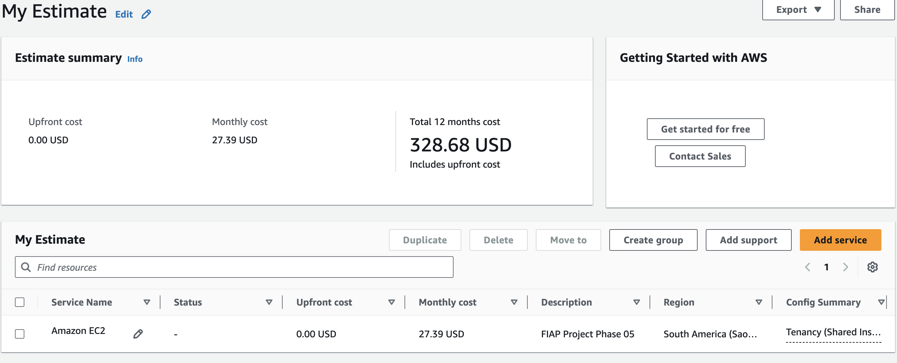
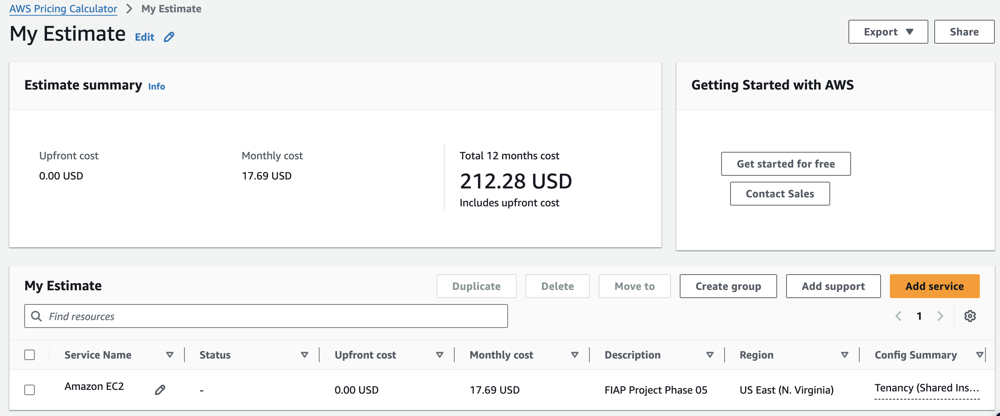

# FIAP - Faculdade de Informática e Administração Paulista

<p align="center">
  <a href="https://www.fiap.com.br/">
    
  </a>
</p>

## 👥 Grupo 28

## 👨‍🎓 Integrantes:

- Amanda Vieira Pires (RM566330)
- Ana Gabriela Soares Santos (RM565235)
- Bianca Nascimento de Santa Cruz Oliveira (RM561390)
- Milena Pereira dos Santos Silva (RM565464)
- Nayana Mehta Miazaki (RM565045)

## 👩‍🏫 Professores:

### Tutor(a)

- Lucas Gomes Moreira

### Coordenador(a)

- André Godoi

---

# 🌾 FarmTech Solutions - Projeto de IA para Agricultura

### 🎥 Assista à demonstração no YouTube

[]([adicionar-link-aqui])

## 📋 Sobre o Projeto

O **FarmTech Solutions** é um projeto de Inteligência Artificial desenvolvido para a **Fase 5 do curso de Inteligência Artificial da FIAP**. O projeto visa analisar dados agrícolas de uma fazenda de médio porte (200 hectares) para prever rendimento de safras e identificar tendências de produtividade.

### 🎯 Objetivos

- **Análise Exploratória**: Compreender padrões nos dados agrícolas
- **Clustering**: Identificar grupos naturais de produtividade e detectar outliers
- **Modelagem Preditiva**: Desenvolver 5 modelos de regressão para prever Yield
- **Validação**: Avaliar performance dos modelos com métricas robustas

### 📊 Dataset

**Arquivo**: `crop_yield.csv`
**Registros**: 156 observações
**Culturas**: 4 tipos (Cocoa, Oil palm fruit, Rice paddy, Rubber)
**Variáveis**:
- **Crop**: Tipo de cultura
- **Precipitation**: Precipitação (mm/dia)
- **Specific Humidity**: Umidade específica (g/kg)
- **Relative Humidity**: Umidade relativa (%)
- **Temperature**: Temperatura (°C)
- **Yield**: Rendimento (toneladas/hectare)

## 🏗️ Estrutura do Projeto

```
chap1-phase05-farm-tech/
├── data/
│   ├── raw/
│   │   └── crop_yield.csv          # Dataset original
│   └── processed/
│       └── dataset_ready.csv       # Dataset processado
├── models/
│   └── scaler.pkl                  # Scaler salvo
├── FarmTech_Solutions_ML.ipynb     # Notebook consolidado
├── requirements.txt                # Dependências
└── README.md                      # Este arquivo
```

## 🔄 Pipeline de Machine Learning

### Fluxo do Projeto

```
📊 Dataset Original → 🔍 EDA → 🛠️ Preparação → 🔗 Clustering → 🤖 Modelagem → 📊 Validação → 🏆 Modelo Final
```

### Etapas Principais

**1. 📊 Dados** (156 registros, 4 culturas)

**2. 🔍 EDA** (Yield bimodal por cultura, correlações)

**3. 🛠️ Preparação** (12 features: 4 originais + 4 criadas + 4 dummies)

**4. 🔗 Clustering** (K-means, DBSCAN, Hierárquico - análise por cultura)

**5. 🤖 Modelagem** (5 algoritmos: Linear, Random Forest, XGBoost, SVR, Neural)

**6. 📊 Validação** (5-fold CV, análise de overfitting)

**7. 🏆 Seleção** (Random Forest: R² = 0.987, RMSE = 2,775)

### Critérios de Qualidade

**✅ Atendidos:**
- Reprodutibilidade (random_state=42)
- Validação robusta (5-fold CV)
- Métricas múltiplas (R², RMSE, MAE)
- Interpretabilidade (feature importance)

## 📝 Metodologia

### 1. **Análise Exploratória (EDA)**
- Estatísticas descritivas
- Distribuições das variáveis
- Correlações entre features
- Análise por tipo de cultura

### 2. **Preparação dos Dados**
- One-hot encoding para variáveis categóricas
- Feature engineering (4 features derivadas)
- Normalização dos dados
- Validação da qualidade

### 3. **Clustering**
- K-means clustering
- DBSCAN clustering
- Clustering hierárquico
- Análise de tendências

### 4. **Modelagem Preditiva**
- 5 algoritmos de regressão
- Validação cruzada 5-fold
- Análise de overfitting
- Feature importance

## 🚀 Como Executar

### 1. **Pré-requisitos**

- Python 3.8+
- Jupyter Notebook
- Git

### 2. **Instalação**

```bash
# Clone o repositório
git clone https://github.com/fiap-ia-2025/chap1-phase4-agricultural-machine

# Entre no diretório
cd chap1-phase05-farm-tech

# Crie um ambiente virtual
python -m venv venv

# Ative o ambiente virtual
# Windows:
venv\Scripts\activate
# macOS/Linux:
source venv/bin/activate

# Instale as dependências
pip install -r requirements.txt
```

### 3. **Execução**

```bash
# Inicie o Jupyter Notebook
jupyter notebook

# Execute o notebook consolidado:
# FarmTech_Solutions_ML.ipynb
```

## 🛠️ Tecnologias e Dependências

### Tecnologias Utilizadas

- **Python 3.8+**
- **Pandas**: Manipulação de dados
- **NumPy**: Operações numéricas
- **Scikit-learn**: Algoritmos de ML
- **XGBoost**: Gradient boosting
- **TensorFlow/Keras**: Neural networks
- **Matplotlib/Seaborn**: Visualizações
- **Jupyter Notebook**: Ambiente de desenvolvimento

### Dependências

```
pandas>=1.3.0
numpy>=1.21.0
scikit-learn>=1.0.0
xgboost>=1.5.0
tensorflow>=2.8.0
matplotlib>=3.5.0
seaborn>=0.11.0
jupyter>=1.0.0
```

## 🏆 Resultados Principais

### 🏆 Modelo Final Escolhido: Random Forest

**Performance:**
- **R² = 0.987**: Explica 98.7% da variância
- **RMSE = 2,775 ton/ha**: Erro médio baixo
- **MAE = 1,533 ton/ha**: Erro absoluto baixo

**Robustez:**
- **Overfitting = 0.011**: Controlado e aceitável
- **Estabilidade = 0.008**: Alta consistência

### 📊 Insights Principais

**Top 5 Features Mais Importantes:**
1. **Crop_Oil palm fruit**: Maior impacto no modelo
2. **Crop_Rice, paddy**: Segundo maior impacto
3. **Temperature at 2 Meters (C)**: Fator climático mais importante
4. **Precipitation (mm day-1)**: Segundo fator climático
5. **Crop_Cocoa, beans**: Terceiro tipo de cultura

**Categorização por Importância:**
- **Features Dummies (Culturas)**: ~60% da importância total
- **Features Originais (Climáticas)**: ~30% da importância total
- **Features Criadas (Derivadas)**: ~10% da importância total

### ⚠️ Limitações Identificadas

- **Dataset pequeno**: 156 registros podem limitar generalização para outras culturas
- **Domínio específico**: Modelo treinado apenas para 4 culturas específicas
- **Variáveis limitadas**: Apenas 4 variáveis climáticas (pode haver outros fatores importantes)
- **Temporal**: Dados não incluem variação temporal (sazonalidade, tendências)
- **Overfitting leve**: Random Forest apresenta gap entre treino (R²=0.998) e validação (R²=0.987)

## 🎯 Conclusões

O projeto **FarmTech Solutions** demonstra que modelos preditivos podem apoiar significativamente a tomada de decisão agrícola, auxiliando no aumento da produtividade e na redução de riscos climáticos.

**Random Forest** foi escolhido como modelo final, oferecendo alta performance preditiva (98.7% de variância explicada) e interpretabilidade adequada, apesar das limitações identificadas.

# 💰 Orçamento AWS Cloud

A infraestrutura escolhida para rodar o projeto e disponibilizá-lo em produção foi a **AWS Cloud**.

A arquitetura da infraestrutura está representada na imagem abaixo:

<p align="center">
  
</p>

A arquitetura proposta utiliza um ESP32 como dispositivo para coleta de dados, enviando informações via protocolo MQTT para a nuvem da AWS.

Na nuvem, foi escolhida uma instância EC2 que hospeda dois componentes principais:

* RabbitMQ, responsável por gerenciar as mensagens recebidas do ESP32;

* Flask API, que consome os dados do RabbitMQ, armazena-os em arquivos CSV e disponibiliza dois endpoints: consulta dos dados e previsão com base em um modelo de Machine Learning.

A EC2 está associada a um Elastic IP, garantindo que os clientes externos tenham sempre o mesmo endereço fixo para acessar os serviços.

O armazenamento persistente é feito em um volume EBS (Elastic Block Store), que guarda:

* os arquivos de dados em CSV;

* modelo treinado em formato .pkl;

* código-fonte da aplicação e scripts de treinamento.

## 📌 Justificativas de Escolha

* **EC2:** garante um ambiente controlado e flexível para hospedar tanto o broker de mensagens quanto a API e o processo de treinamento.

* **RabbitMQ:** protocolo robusto e confiável para receber mensagens MQTT do ESP32.

* **Flask API:** solução leve para expor endpoints REST de consulta e previsão.

* **Elastic IP:** necessário para que os dispositivos e clientes externos sempre consigam acessar a aplicação no mesmo endereço público.

* **EBS:** armazenamento em blocos persistente, adequado para guardar dados estruturados, modelos e código, funcionando como “HD virtual” da instância.

## 📌 Vantagens

* **Simplicidade:** solução concentrada em uma única EC2.

* **Baixo custo:** uso mínimo de serviços gerenciados, aproveitando EBS incluso.

* **Flexibilidade:** pode rodar tanto a API quanto o treinamento no mesmo servidor.

* **Persistência:** os dados e modelos ficam salvos no EBS mesmo após reinício da instância.


## 📌 Desvantagens

* **Escalabilidade limitada:** uma única EC2 pode não suportar grandes volumes de dados ou muitos acessos simultâneos.

* **Gerenciamento manual:** instalação, configuração e manutenção de RabbitMQ e Flask ficam sob responsabilidade do time.

* **Resiliência:** se a instância falhar, toda a aplicação fica indisponível até reinicialização ou substituição.

## 💸 Estimativas de Custos

Foram realizadas 2 estimativas da Arquitetura de Solução apresentada acima:

1. Região US East (N. Virginia): $ 17.69/mês e $ 212.28/ano
2. Região South America: $ 27.39/mês e $ 328.68/ano

Características da máquina:

* 2 CPUs
* 1 GIB de memória
* 5 Gigabit de rede
* 50 GB de armazenamento (HD)

Seguem as imagens tiradas da AWS das estimativas:

**São Paulo:**

<p align="center">
  
</p>

**N. Virginia:**

<p align="center">
  
</p>

## 🎯 Conclusões

Apesar de a região da Virgínia do Norte (us-east-1) ser mais barata, a escolha seguiremos com a região de São Paulo (sa-east-1), porque:

* Garante acesso rápido aos dados dos sensores, reduzindo a latência.

* Atende às restrições legais que proíbem armazenamento de dados no exterior.

Dessa forma, a solução em São Paulo, mesmo com custo maior, é a mais adequada.

### 🎥 Assista à demonstração no YouTube

[](https://www.youtube.com/watch?v=tuuY2Y89NyU)

**Desenvolvido para a FIAP - Faculdade de Informática e Administração Paulista**
